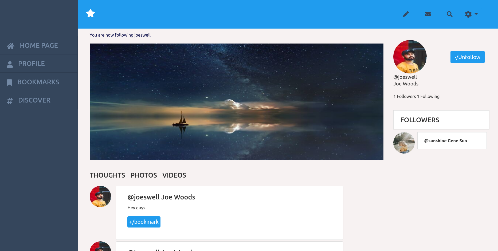

# thoughtstar


This is a capstone project at the end of the main Ruby on Rails curriculum at [Microverse](https:www.microverse.org/) - @microverseinc.


## Built With

- Ruby v3.1.2
- Ruby on Rails v5.2.4

## Description
- The original project specifications can be found [here](https://www.notion.so/Twitter-redesign-f8a8d48453d54d1a949bb0ceab4c8718).
- This project was about implementing a site similar to twitter where users can share their thoughts and ideas and follow other users. On thoughtstar, users share ideas for creating software applications, and how to implement them.
  - Registered users of the app are able to follow other users; users are also able to bookmark ideas from other users.
  - A logged-in user is only able to view their own ideas as well as those of other users that they are following on their homepage.

## Live Demo

[Click here](https://thoughtstar.fly.dev)


## Getting Started

To get a local copy up and running follow these simple example steps.

### Prerequisites

Ruby: 3.1.2
Rails: 6.0.3
Postgres: >= 9.5

### Setup

Install gems with:

```
bundle install
```

Setup database with:

```
   rails db:create
   rails db:migrate
```


### Usage

Start server with:

```
    rails server
```

Open `http://localhost:3000/` in your browser.

### Run tests

```
    rspec
```

### How to use the site
Make sure the server is running
- Go to http://localhost:3000/ in your web browser
- You will be able to access the following routes (among others)
   - http://localhost:3000/
   - http://localhost:3000/thoughts/:id
   - http://localhost:3000/users/:id
   - http://localhost:3000/users/:user_id/bookmarks
   - http://localhost:3000/trends
   
- Follow the links on the site to access the available features, including sign up and sign in functionality.
#### Available features
- A user who is logged in can
   - post their thoughts and ideas on their timeline/home page
   - follow another user
   - unfollow and refollow another user
   - view their own ideas as well as their friends' on their homepage.
   - bookmark another user's thought(s) on their *home page*
   - bookmark another user's thought(s) on their *user profile page*
   - remove a bookmark from their bookmarks page
   - access the latest news in technology on the trends page

### Deployment
- You can deploy on
 - [Heroku](https://devcenter.heroku.com/categories/ruby-support).
 - [Cloud server using Capistrano](https://gorails.com/deploy/ubuntu/18.04)

     #### Capistrano Logging Command:
         `tail -f blogger/shared/log/production.log`
-  [Fly.io](https://fly.io/docs/rails/getting-started/existing/)

## Authors

👤 **Marylene Sawyer**
- Github: [@Bluette1](https://github.com/Bluette1)
- Twitter: [@MaryleneSawyer](https://twitter.com/MaryleneSawyer)
- Linkedin: [Marylene Sawyer](https://www.linkedin.com/in/marylene-sawyer)

## 🤝 Contributing

Contributions, issues and feature requests are welcome!

Feel free to check the [issues page](https://github.com/Bluette1/thoughtstar/issues).

## Show your support

Give a ⭐️ if you like this project!

## Acknowledgments
- [Twitter - Redesign of UI details](https://www.behance.net/gallery/14286087/Twitter-Redesign-of-UI-details)
- [IconArchive](https://iconarchive.com/show/papirus-status-icons-by-papirus-team/avatar-default-icon.html)
- [Unsplash Photos for everyone](https://unsplash.com/)


## 📝 License

This project is [MIT](https://opensource.org/licenses/MIT) licensed
